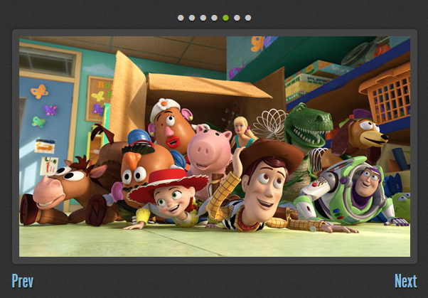
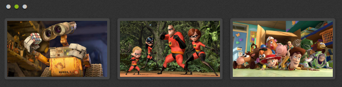
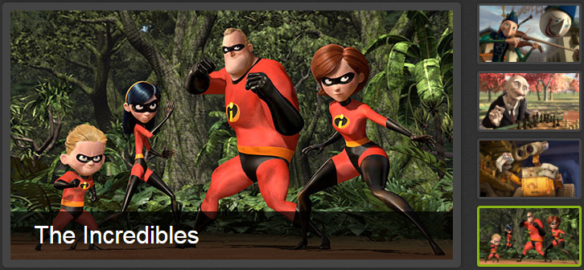

## JS插件说明
### COMMON
#### *urlParam*
---

#### *tools*
---


### LIB

#### *tools*
---

#### *jquery*
---
* Version: 1.8.3
* Usage:
  *  示例一
  ```
  seajs.use('jquery',function($){
    $('.demo').hide();
  });
  ```
  *  示例二
  ```
    seajs.use(['jquery','animateColor']function($,animateColor){
      $('.demo').hide();
      $('.header a').animate({color: '#fff'},500);
    });
  ```

#### *$.cookie*
---
#### *jquery.query*
---
#### *placeholder*
---
#### *animateColor*
---
#### *animateNumber*
---
#### *Amcharts*
---
#### *serial*
---
#### *customSelect*
---
#### *spinner*
---
#### *FancyRadioCheckBox*
---
* Version: 
* Github:
* Website:
#### *alertify*
---
#### *layer*
---
##### 弹窗插件
* Version: 1.8.5
* Github: https://github.com/sentsin/layer
* Website: http://layer.layui.com/1.8.5/

#### *switchable*
---
##### 标签切换、轮播图、幻灯片、手风琴 4合1
* Version: 2.0
* Github: https://github.com/jsw0528/jQuery.Switchable
* Website: http://switchable.mrzhang.me/

效果图示例
* 轮播图

  
* 带按钮的轮播

 
 
 * 多组联动轮播
 
 
 
 * 垂直手风琴
 
 
 
 * 水平手风琴

 
 
 * 幻灯片
 
  

#### *fullPage*
---

#### *fullPageCss*
---
#### *jquery.event.move*
---
#### *jquery.twentytwenty*
---